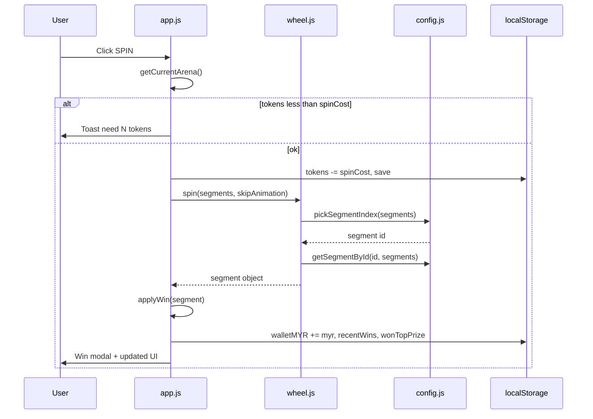

# Squid Casino Spin Minigame

A Squid Game inspired casino spin-to-win minigame built with vanilla HTML, CSS, and JavaScript.

## Specification

### Overview

- **Stack:** Static site — `index.html`, `css/styles.css`, ES modules under `js/`.
- **Purpose:** Front-end prototype; no backend, real wallet, or payment integration.
- **Wheel:** 8 segments (45° each), weighted random outcome, CSS transition spin (~4.2s) or instant when skip animation is enabled.
- **Currency:** Malaysian Ringgit (MYR), formatted with `en-MY` locale.

### Arenas

Three selectable zones. Each has its own background, mascot, wheel frame art, visual theme, prize table, banner top prize, and spin token cost. Only one arena is active at a time.

| ID | Zone | Theme | Spin cost (tokens) | Max prize (banner + jackpot) |
|----|------|-------|--------------------|------------------------------|
| 1 | Red Light, Green Light | Squid | 1 | MYR 288 |
| 2 | Mingle | Casino | 2 | MYR 888 |
| 3 | Jump Rope | Squid | 5 | MYR 2,688 |

- **Default arena:** 1 (Red Light, Green Light).
- **Arena picker:** Bottom dock (desktop/tablet) or horizontal strip (mobile). Inactive arenas show “Pick Arena”; active arena hides that button.
- **Switching arena:** Rebuilds wheel labels and sector colors for the new prize table (including when switching between two Squid-themed arenas).

### Prize data model

Each wheel segment is an object built at load time in [`js/config.js`](js/config.js):

| Field | Source | Purpose |
|-------|--------|---------|
| `id` | `0`–`7` (tier index) | Wheel slot index; used for rotation math and DOM `--i` |
| `myr` | `ARENA_PRIZES[arenaId][tier]` | Payout added to wallet on win |
| `label` | `MYR {n}` via `en-MY` locale | Shown on wheel and in win modal |
| `weight` | `SEGMENT_TEMPLATE[tier]` | Relative probability (same all arenas) |
| `icon` | `circle` / `square` / `triangle` | Squid Game marker SVG on label |
| `rarity` | `low` / `uncommon` / `rare` / `jackpot` | Visual tier band (two slices per band) |
| `sectorColor` | Hex per tier | Wheel conic gradient (all themes) |

`buildArenaSegments(prizes)` merges `ARENA_PRIZES` amounts with `SEGMENT_TEMPLATE` metadata. Each arena stores the result on `arena.segments`. `maxDisplayPrize` equals tier-8 `myr` (top/jackpot) for that arena.

**Arena MYR tables** (`ARENA_PRIZES`):

```text
Arena 1: [0, 3, 8, 18, 28, 68, 128, 288]
Arena 2: [0, 9, 24, 54, 84, 204, 384, 888]
Arena 3: [0, 28, 75, 168, 260, 630, 1200, 2688]
```

Scaling is tier-by-tier (rounded “clean” numbers), not a single multiplier on every slot.

### Wheel prize table (weights + payouts)

Eight tiers per wheel. **Weights are identical in every arena**; only `myr` / `label` change. Weights sum to **100** (each weight ≈ **% chance** per spin).

| Tier | `id` | Weight | Chance | Icon | Rarity | `sectorColor` | Arena 1 | Arena 2 | Arena 3 |
|------|------|--------|--------|------|--------|---------------|---------|---------|---------|
| 1 | 0 | 23 | 23% | circle | low | `#6b7589` | MYR 0 | MYR 0 | MYR 0 |
| 2 | 1 | 19 | 19% | square | low | `#4f5869` | MYR 3 | MYR 9 | MYR 28 |
| 3 | 2 | 17 | 17% | circle | uncommon | `#3b82d6` | MYR 8 | MYR 24 | MYR 75 |
| 4 | 3 | 14 | 14% | circle | uncommon | `#2563b5` | MYR 18 | MYR 54 | MYR 168 |
| 5 | 4 | 12 | 12% | triangle | rare | `#8b4fd9` | MYR 28 | MYR 84 | MYR 260 |
| 6 | 5 | 9 | 9% | square | rare | `#6c35ad` | MYR 68 | MYR 204 | MYR 630 |
| 7 | 6 | 4 | 4% | triangle | jackpot | `#b8890a` | MYR 128 | MYR 384 | MYR 1,200 |
| 8 | 7 | 2 | 2% | triangle | jackpot | `#e8c84a` | MYR 288 | MYR 888 | MYR 2,688 |
| **Total** | | **100** | **100%** | | | | | | |

**Rarity colors** are the same on every arena and theme (squid + casino): gray → blue → purple → gold for quick readability. Odds and MYR amounts are unchanged.

### Weighted selection algorithm

Implemented in `pickSegmentIndex(segments)` ([`js/config.js`](js/config.js)):

1. `totalWeight` = sum of all `segment.weight` (100).
2. `roll` = random in `[0, totalWeight)`.
3. Iterate segments in tier order (`id` 0 → 7), subtract each `weight` from `roll`.
4. When `roll <= 0`, return that segment’s `id`.
5. Fallback: last segment (`id` 7) if floating-point edge cases occur.

**Properties:**

- Order of tiers in the array defines which slice of the number line each outcome owns; with fixed weights, order does not change probabilities.
- Each spin is independent; no pity timer, streak cap, or seed.
- Outcome is chosen **before** the wheel animation runs; animation is cosmetic alignment to the pre-selected `id`.

**Approximate expected payout per spin** (MYR × probability):

| Arena | E[value] per spin |
|-------|-------------------|
| 1 | ~24.81 |
| 2 | ~74.91 |
| 3 | ~231.25 |

*(Informational only; not shown in UI. Tokens are not convertible to MYR in the prototype.)*

### Spin lifecycle (prize + tokens)



**Guards:**

- Second spin while `wheel.spinning` is ignored.
- Arena change while spinning is blocked (toast).
- Tokens are deducted **up front**; if animation fails, tokens are not refunded (prototype behavior).

### Wheel animation and pointer

[`js/wheel.js`](js/wheel.js) aligns the rotor to the winning segment after the random pick:

| Parameter | Value |
|-----------|-------|
| `POINTER_ANGLE` | `0°` (pointer at top) |
| `SEGMENT_ANGLE` | `45°` per slot |
| Full rotations | `5–8` random full turns + offset to target |
| Jitter | ±`(45° - 8°) / 2` within segment arc |
| Duration | `4200ms`, easing `cubic-bezier(0.2, 0.8, 0.2, 1)` |
| Skip | `skipAnimation` state or `prefers-reduced-motion` → instant set rotation |

Segment center for slot `i`: `i × 45° + 22.5°`. The rotor rotates so that center lines up with the pointer.

[`js/app.js`](js/app.js) `buildSectors(theme, segments)`:

- Rebuilds DOM labels from `segment.label`.
- Sets conic background via `getSectorBackgroundLayers(theme, segments)`.
- Rebuild triggers when **theme or arena id** changes (so Arena 1 ↔ 3 both update labels even though both use `squid` theme).

### Applying wins (`applyWin`)

After `wheel.spin()` resolves:

| Step | Logic |
|------|--------|
| Wallet | `state.walletMYR += segment.myr` (MYR 0 still allowed) |
| Last win | `state.lastWin = { label, myr, at: timestamp }` |
| Top prize flag | If `segment.myr >= getArenaTopPrizeMYR(currentArenaId)` → `wonTopPrize = true` (global flag, any arena) |
| History | Prepend to `recentWins`, keep max **5** entries |
| Persist | `saveState` then `render` then `openWinModal` |

Winnings are **not** auto-converted to tokens. Tokens and MYR wallet are separate balances.

### Win modal rules

| Condition | Subtitle | Amount styling |
|-----------|----------|----------------|
| `myr === 0` | “Better luck next spin!” | `.is-zero` |
| `myr >= topPrize` (arena tier 8) | “Top prize unlocked!” | `.is-big` if also ≥ half top |
| Else | “Added to your total winnings.” | `.is-big` if `myr >= topPrize / 2` |

**Big-win threshold** (`is-big`) per arena:

| Arena | Top prize | Half threshold (`is-big`) |
|-------|-----------|---------------------------|
| 1 | 288 | ≥ 144 |
| 2 | 888 | ≥ 444 |
| 3 | 2,688 | ≥ 1,344 |

Screen reader (`aria-live`): “No win this spin.” or “You won {label}.”

### Promo banner vs actual prizes

| UI element | Data source | Notes |
|------------|-------------|-------|
| “Win Up To” (`#maxPrizeDisplay`) | `arena.maxDisplayPrize` | Always tier-8 amount for **current** arena |
| Marquee “Jackpot” | `getArenaTopPrizeMYR(currentArenaId)` | Same as max display; 4 duplicated items in scroll track |
| `aria-label` on promo | Static line + jackpot line | Updated on every `render()` / arena switch |

Marquee alternation timing is CSS-only (`promo-alt-static` / `promo-alt-marquee` keyframes, ~8s cycle). It does not affect game logic.

### Winner list (display only)

- **Eligible prizes:** Top 2 MYR tiers per arena only — Arena 1: 128 / 288; Arena 2: 384 / 888; Arena 3: 1200 / 2688 (`getWinnerListPrizeValues()` in config).
- **Your rows:** Up to 5 from `state.recentWins` (newest first), filtered to eligible prizes; first qualifying row marked “you”.
- **Fill:** Mock entries from `MOCK_WINNERS` in `app.js` until 8 rows (uses top-tier amounts across all arenas).
- **Dedup:** Skips mock if same masked user + `myr` already present.

### Tokens and economy

| Rule | Value |
|------|-------|
| Starting tokens | 12 |
| Token top-up (+ button) | +5 per click |
| Spin deduction | Arena spin cost (1 / 2 / 5) |
| Insufficient tokens | Toast: “You need N token(s) to spin.” |
| Winnings | Added to `walletMYR` (displayed in Daily Mission card) |
| Token balance | Single shared pool across all arenas (shown as “Ticket Left” and in hub cost) |

Hub **SPIN** button shows the current arena’s token cost beside the triangle icon.

### Promo banner (arena header)

- **Static panel:** “Spin Now & Win Up To” + arena `maxDisplayPrize`.
- **Marquee panel:** Scrolling “Jackpot” + arena top prize; alternates with static panel on a timed cycle.
- **Desktop (≥1024px):** Full-width promo ribbon; separate Jackpot badge removed.
- **Mobile (≤767px):** Full-width promo; jackpot badge hidden.

### UI and layout

| Viewport | Behavior |
|----------|----------|
| Desktop (≥1024px) | Sidebar nav + arena card + Daily Mission / Winner List below |
| Tablet/mobile (≤1023px) | Sidebar hidden; fixed bottom nav (HOME, WALLET, SPIN NOW, PROMOTION, LIVE CHAT) |
| Mobile (≤767px) | Full-viewport arena; mascot hidden; jackpot badge hidden; mission/winner cards below fold |

Other UI:

- **Skip animation:** Checkbox in sidebar; persisted; skips wheel transition (respects `prefers-reduced-motion`).
- **Win modal:** Shows amount, subtitle, COLLECT; Escape or backdrop click closes.
- **Winner list:** Up to 8 rows (recent wins + sample entries).
- **Daily Mission:** Every 10 completed spins awards 5 tokens (milestones at 10 / 20 / 30 / 40 spins). Max 20 free tokens per calendar day; resets at midnight (local time).

### Persisted state (`localStorage` key: `squidSpinState`)

| Field | Description |
|-------|-------------|
| `tokens` | Shared spin balance |
| `walletMYR` | Cumulative winnings |
| `currentArenaId` | Last selected arena (1–3) |
| `skipAnimation` | Boolean |
| `wonTopPrize` | Boolean (any arena top prize won) |
| `lastWin` | Last spin result `{ label, myr, at }` |
| `recentWins` | Up to 5 recent wins |
| `dailyMissionDate` | `YYYY-MM-DD` for daily reset |
| `dailySpinCount` | Spins completed today |
| `dailyMissionRewardsClaimed` | Mission rewards claimed today (0–4) |

### Configuration source

| What to change | Where |
|----------------|--------|
| MYR per tier per arena | `ARENA_PRIZES` |
| Odds, icons, squid colors | `SEGMENT_TEMPLATE` |
| Spin cost, banner cap | `ARENAS[].spinCost`, `ARENAS[].maxDisplayPrize` |
| Arena art / theme | `ARENAS[].background`, `mascot`, `wheelFrame`, `wheelTheme` |
| Starting tokens, top-up | `DEFAULT_STATE` in [`js/storage.js`](js/storage.js), `TOKEN_TOP_UP` in config |

After editing `ARENA_PRIZES`, ensure `maxDisplayPrize` matches the last tier value. Rebuild is automatic on page load (`buildArenaSegments` runs at module init).

### Module responsibilities

| File | Prize-related role |
|------|-------------------|
| [`js/config.js`](js/config.js) | Segment definitions, `pickSegmentIndex`, `getSegmentById`, arena getters, wheel background gradients |
| [`js/wheel.js`](js/wheel.js) | Spin animation, calls picker, returns winning `segment` object |
| [`js/app.js`](js/app.js) | Token gate, `applyWin`, UI labels, promo, arena switch, win modal, mission UI |
| [`js/mission.js`](js/mission.js) | Daily spin counter, milestone rewards, midnight reset |
| [`js/storage.js`](js/storage.js) | Persist `tokens`, `walletMYR`, `recentWins`, `wonTopPrize`, `currentArenaId`, mission fields |

### Constants

| Constant | Value | Used for |
|----------|-------|----------|
| `SPIN_DURATION_MS` | 4200 | Wheel CSS transition length |
| `SEGMENT_ANGLE` | 45° | 8 segments; rotation math |
| `POINTER_ANGLE` | 0° | Pointer at top of wheel |
| `TOKEN_TOP_UP` | 5 | Dev “+” button grant |
| `MISSION_SPINS_PER_REWARD` | 10 | Spins needed per mission reward |
| `MISSION_REWARD_TOKENS` | 5 | Tokens granted per milestone |
| `MISSION_MAX_DAILY_TOKENS` | 20 | Max free mission tokens per day |
| `DEFAULT_ARENA_ID` | 1 | New player default zone |
| `STORAGE_KEY` | `squidSpinState` | `localStorage` key |

### Not implemented (prototype limits)

- No server-side validation of spins or balances.
- No separate token pool per arena (one shared `tokens` count).
- No cost-adjusted RTP display; higher arenas cost more tokens but are not normalized to expected MYR per token in the UI.
- `wonTopPrize` is a single boolean (not per-arena).
- Sidebar / bottom nav links are placeholders (`#`).

---

## Features

- Three themed arenas with different background, mascot art, prize tiers, and spin costs.
- Casino-styled prize wheel with Squid Game shape markers.
- Weighted prize selection and animated spin behavior.
- Token balance, winnings, recent winners, and skip-animation preference stored in `localStorage`.
- Responsive layout for desktop and mobile screens.

## Run Locally

This project uses browser ES modules, so serve it over HTTP instead of opening `index.html` directly.

```bash
npm run dev
```

Then open:

```text
http://localhost:3000/
```

You can also use any static server, such as VS Code Live Server.

## Validate JavaScript

```bash
npm run check:js
```

## Project Structure

```text
.
├── index.html
├── css/
│   └── styles.css
├── js/
│   ├── app.js
│   ├── config.js
│   ├── icons.js
│   ├── storage.js
│   └── wheel.js
└── assets/
```

## GitHub Pages

This is a static site and can be published directly with GitHub Pages.

1. Push the repository to GitHub.
2. Open the repository settings.
3. Go to **Pages**.
4. Set the source to the main branch and root folder.
5. Save and wait for GitHub Pages to deploy.

## Notes

- Prize results and balances are stored locally in the browser only.
- The project loads Google Fonts from the public CDN.
